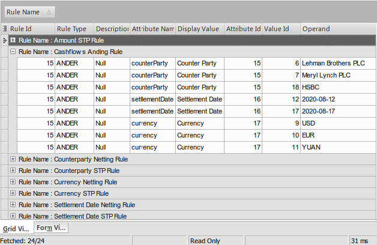

# j-easy2complex-rules
A simple Business Rule Engine. Some parts are taken from j-easy rules

What is JEasy-2-Complex Rules?
===
JEasy-2-Complex Rules is a Rule Engine written in Java. Its inspired by [Easy Rules](https://github.com/j-easy/easy-rules).
Some core features have been taken from Easy Rules.

Why a new Rule Engine?
===
I worked on a custom rule engine while working on a credit derivatives settlement system. 
That rule engine was tightly coupled with the product. We always wanted to create a standalone version of it.
I never found time to write a standalone version of it during my work years. Then I came across Easy Rules. In my spare time
I started experimenting with Easy Rules and thought _"Why not combine features of Easy Rules with the rule engine that I worked upon and
create a database backed standalone Rules Engine?"_. It's this idea that took me to write a new Rule Engine that's backed by 
a database and can run independently of the actual product. 
 
E-R Diagram
---


Example
---
**Group together a given set of cashflows when a matching rule exist in the database for counter party, currency and settlement date.**




```java
@Test @Order(5)
    public void givenCashFlowsHavingSameSettlementDate_WhenDistinctCpty_DistinctCurrency_ThenGroupCashflows() {
        var ruleService = container.select(BusinessRuleServiceImpl.class).get();
        var ruleAttributeDao = container.select(RuleAttributeDaoImpl.class).get();
        var cashflowDao = container.select(CashflowDao.class).get();
        var ruleDao = container.select(RuleDaoImpl.class).get();

        BusinessRulesTestProvider.createRule("Cashflows Anding Rule","ANDER", 1, ruleService);
        var businessRule = ruleDao.findByNameAndType("Cashflows Anding Rule", "ANDER").orElseThrow();
        BusinessRulesTestProvider.createAttribute(businessRule, "counterParty", "ANDER", "Counter Party", ruleService);
        BusinessRulesTestProvider.createAttribute(businessRule, "settlementDate", "ANDER", "Settlement Date", ruleService);
        BusinessRulesTestProvider.createAttribute(businessRule, "currency", "ANDER", "Currency", ruleService);
        var stmtDateAttrib = ruleAttributeDao.findRuleAttribute("settlementDate","ANDER").orElseThrow();
        var cptyAttrib = ruleAttributeDao.findRuleAttribute("counterParty", "ANDER").orElseThrow();
        var currencyAttrib = ruleAttributeDao.findRuleAttribute("currency", "ANDER").orElseThrow();
        createValue(cptyAttrib, "Meryl Lynch PLC", ruleService);
        createValue(cptyAttrib, "Lehman Brothers PLC", ruleService);
        createValue(cptyAttrib, "HSBC", ruleService);
        createValue(stmtDateAttrib, LocalDate.now().plusDays(15).toString(), ruleService);
        createValue(stmtDateAttrib, LocalDate.now().plusDays(10).toString(), ruleService);
        //We are deliberately not creating a rule for LocalDate.now().plusDays(5)
        //This will ensure that cashflows having settlement date as LocalDate.now().plusDays(5)
        // are filtered out from grouping criteria. The AndService will provide Group AND-ING Condition
        // for cashflows on the basis of CounterParty AND Currency AND SettlementDate criteria.
        // The Action will only group cashflows if the values corresponding to 'Cashflows Anding Rule'
        // in database are same as the incoming cashflow
        // The "HSBC" and "Lehman Brothers PLC" with "YUAN" will be filtered out from AND-ING Criteria
        // as their Settlement Date is LocalDate.now().plusDays(5) and no AND-ING rule exist for it.
        createValue(currencyAttrib, "USD", ruleService);
        createValue(currencyAttrib, "EUR", ruleService);
        createValue(currencyAttrib, "YUAN", ruleService);

        var cf3 = createCashFlow("Meryl Lynch PLC", "USD", 220000.00, LocalDate.now().plusDays(15));
        var cf6 = createCashFlow("Meryl Lynch PLC", "USD", 10000.00, LocalDate.now().plusDays(15));
        var cf7 = createCashFlow("Meryl Lynch PLC", "USD", 20000.00, LocalDate.now().plusDays(15));
        var cf8 = createCashFlow("Lehman Brothers PLC", "EUR", 90000.00, LocalDate.now().plusDays(10));
        var cf9 = createCashFlow("Lehman Brothers PLC", "EUR", 30500.00, LocalDate.now().plusDays(10));
        var cf10 = createCashFlow("Lehman Brothers PLC", "YUAN", 20900.00, LocalDate.now().plusDays(5));
        var cf11 = createCashFlow("HSBC", "INR", 10900.00, LocalDate.now().plusDays(5));
        cashflowDao.save(cf3);
        cashflowDao.save(cf6);
        cashflowDao.save(cf7);
        cashflowDao.save(cf8);
        cashflowDao.save(cf9);
        cashflowDao.save(cf10);
        cashflowDao.save(cf11);
        var andComposer = container.select(AndComposer.class).get();
        var cashflows = new LinkedList<>(cashflowDao.findBySettlementDateBetween(LocalDate.now().plusDays(5), LocalDate.now().plusDays(15)));
        var cashflowMap = groupCashflows(cashflows, andingConditionService);
        assertEquals(2, cashflowMap.size());
        assertEquals(2, cashflowMap.get("Lehman Brothers PLC-EUR").size());
        assertEquals(3, cashflowMap.get("Meryl Lynch PLC-USD").size());
    }
```

```java
Map<String, Set<Cashflow>> groupCashflows(List<Cashflow> cashflows, ConditionService conditionService) {

        Map<String, Set<Cashflow>> cashflowMap = new ConcurrentHashMap<>();
        var rulesEngine = new InferenceRuleEngine();
        var facts = new Facts();
        var rules = new Rules();
        var cnt = 1;
        for(Cashflow cashflow: cashflows) {
            facts.put("cashflow-" + cnt, cashflow);
            cnt++;
            var andCondition = conditionService.getCondition(cashflow, "Cashflows Anding Rule", "ANDER");
            Set<Cashflow> cashflowSet = new HashSet<>();
            //Hack the comparator logic of DefaultRule/BasicRule in order to override its internal logic as below.
            //This is needed to register our Rule with Rules which uses a Set<Rule> to register new Rules
            //with the comparator logic written in BasicRule.
            //Otherwise the first cashflow in the collection will be the only Rule in registered Rules.
            var andOrRules = new RuleBuilder((o1, o2) -> o1.getId().compareTo(cashflow.getId()))
                    .when(andCondition)
                    .then(action -> {
                        String key = cashflow.getCounterParty() +"-"+ cashflow.getCurrency();
                        if(cashflowMap.containsKey(key)){
                            cashflowMap.get(key).add(cashflow);
                        }else{
                            cashflowSet.add(cashflow);
                            cashflowMap.put(cashflow.getCounterParty() +"-"+ cashflow.getCurrency(),cashflowSet);
                        }
                    })
                    .build();
            rules.register(andOrRules);
        }
        rulesEngine.fire(rules, facts);
        return cashflowMap;
    }
```

Similarly, if we want to group cashflows even if one of the attributes are present in database, then use `OrConditionService` as below:
```java
@Test @Order(5)
    public void givenCashFlowsWhenOrService_ThenGroupCashflows() {
        var ruleService = container.select(BusinessRuleServiceImpl.class).get();
        var ruleAttributeDao = container.select(RuleAttributeDaoImpl.class).get();
        var cashflowDao = container.select(CashflowDao.class).get();
        var ruleDao = container.select(RuleDaoImpl.class).get();

        BusinessRulesTestProvider.createRule("Cashflows Anding Rule","ANDER", 1, ruleService);
        var businessRule = ruleDao.findByNameAndType("Cashflows Anding Rule", "ANDER").orElseThrow();
        BusinessRulesTestProvider.createAttribute(businessRule, "counterParty", "ANDER", "Counter Party", ruleService);
        BusinessRulesTestProvider.createAttribute(businessRule, "settlementDate", "ANDER", "Settlement Date", ruleService);
        BusinessRulesTestProvider.createAttribute(businessRule, "currency", "ANDER", "Currency", ruleService);
        var stmtDateAttrib = ruleAttributeDao.findRuleAttribute("settlementDate","ANDER").orElseThrow();
        var cptyAttrib = ruleAttributeDao.findRuleAttribute("counterParty", "ANDER").orElseThrow();
        var currencyAttrib = ruleAttributeDao.findRuleAttribute("currency", "ANDER").orElseThrow();
        createValue(cptyAttrib, "Meryl Lynch PLC", ruleService);
        createValue(cptyAttrib, "Lehman Brothers PLC", ruleService);
        createValue(cptyAttrib, "HSBC", ruleService);
        createValue(stmtDateAttrib, LocalDate.now().plusDays(15).toString(), ruleService);
        createValue(stmtDateAttrib, LocalDate.now().plusDays(10).toString(), ruleService);
        //We are deliberately not creating a rule for LocalDate.now().plusDays(5) and making use of "ANDER" Business Rule
        //This will ensure that cashflows having settlement date as LocalDate.now().plusDays(5)
        //are still not filtered out from grouping criteria. The OrService will provide Group OR-ING Condition
        //for cashflows on the basis of CounterParty OR Currency OR SettlementDate criteria.
        //The Action will group them on the basis of Rule values corresponding to 'Cashflows AND-ING Rule'
        //in database are same as the incoming cashflow.
        //The OR-ING will ensure that "HSBC" and "Lehman Brothers PLC" with "YUAN" won't be filtered out from OR-ING Criteria
        //and new groups are created for the two based on the Currency and name
        createValue(currencyAttrib, "USD", ruleService);
        createValue(currencyAttrib, "EUR", ruleService);
        createValue(currencyAttrib, "YUAN", ruleService);

        var cf3 = createCashFlow("Meryl Lynch PLC", "USD", 220000.00, LocalDate.now().plusDays(15));
        var cf6 = createCashFlow("Meryl Lynch PLC", "USD", 10000.00, LocalDate.now().plusDays(15));
        var cf7 = createCashFlow("Meryl Lynch PLC", "USD", 20000.00, LocalDate.now().plusDays(15));
        var cf8 = createCashFlow("Lehman Brothers PLC", "EUR", 90000.00, LocalDate.now().plusDays(10));
        var cf9 = createCashFlow("Lehman Brothers PLC", "EUR", 30500.00, LocalDate.now().plusDays(10));
        var cf10 = createCashFlow("Lehman Brothers PLC", "YUAN", 20900.00, LocalDate.now().plusDays(5));
        var cf11 = createCashFlow("HSBC", "INR", 10900.00, LocalDate.now().plusDays(5));
        cashflowDao.save(cf3);
        cashflowDao.save(cf6);
        cashflowDao.save(cf7);
        cashflowDao.save(cf8);
        cashflowDao.save(cf9);
        cashflowDao.save(cf10);
        cashflowDao.save(cf11);
        var conditionService = container.select(OrComposer.class).get();
        var cashflows = new LinkedList<>(cashflowDao.findBySettlementDateBetween(LocalDate.now().plusDays(5), LocalDate.now().plusDays(15)));
        var cashflowMap = groupCashflows(cashflows, conditionService);
        assertEquals(4, cashflowMap.size());
        assertEquals(2, cashflowMap.get("Lehman Brothers PLC-EUR").size());
        assertEquals(3, cashflowMap.get("Meryl Lynch PLC-USD").size());
        assertEquals(1, cashflowMap.get("HSBC-INR").size());
        assertEquals(1, cashflowMap.get("Lehman Brothers PLC-YUAN").size());
    }
```

where `Cashflow` is defined as:  
```java
@Entity
@Table(name = "cashflows")
public class Cashflow implements WorkflowItem<Long> {

    @Id
    @GeneratedValue(strategy = GenerationType.IDENTITY)
    private Long id;

    @Column(name = "counter_party")
    private String counterParty;

    @Column
    private String currency;

    @Column(name = "settlement_date")
    private LocalDate settlementDate;

    @Column
    private Double amount;

    @Column(name = "version", columnDefinition ="int default 0")
    private Integer version;

    @Column(name = "created_on")
    private LocalDateTime createdOn;

    @Column(name = "stp_allowed", columnDefinition ="boolean default true")
    private boolean stpAllowed;

    @Column(name = "notes")
    private String note;
}
```

Apply Rules Explicitly
---
Allows explicit application of rules. See example below where explicit conditions are fetched from db:


```java
Condition cptyNettingCondition = conditionService.getCondition(cashflow, "Counterparty Netting Rule", "NETTING");
Condition currencyCondition = conditionService.getCondition(cashflow, "Currency Netting Rule", "NETTING");
Condition stmtDateCondition = conditionService.getCondition(cashflow, "Settlement Date Netting Rule", "NETTING");
```

**and** `and` logic is applied as:
```java
RuleBuilder((o1, o2) -> o1.getId().compareTo(cashflow.getId()))
    .when(cptyNettingCondition.and(currencyCondition).and(stmtDateCondition))
    .then(action -> {
 ...
}
```

```java
@Test @Order(3)
    public void givenCashFlowsHavingSameSettlementDate_WhenDistinctCpty_DistinctCurrency_ThenNettCashflows() {
        BusinessRuleService ruleService = container.select(BusinessRuleServiceImpl.class).get();
        RuleAttributeDao ruleAttributeDao = container.select(RuleAttributeDaoImpl.class).get();
        CashflowDao cashflowDao = container.select(CashflowDao.class).get();

        RuleAttribute stmtDateAttrib = ruleAttributeDao.findRuleAttribute("settlementDate","NETTING").orElseThrow();
        RuleAttribute cptyAttrib = ruleAttributeDao.findRuleAttribute("counterParty", "NETTING").orElseThrow();
        RuleAttribute currencyAttrib = ruleAttributeDao.findRuleAttribute("currency", "NETTING").orElseThrow();
        createValue(cptyAttrib, "Meryl Lynch PLC", ruleService);
        createValue(cptyAttrib, "Lehman Brothers PLC", ruleService);
        createValue(stmtDateAttrib, LocalDate.now().plusDays(10).toString(), ruleService);
        createValue(currencyAttrib, "USD", ruleService);
        createValue(currencyAttrib, "EUR", ruleService);
        createValue(currencyAttrib, "YUAN", ruleService);

        Cashflow cf3 = createCashFlow("Meryl Lynch PLC", "USD", 220000.00, LocalDate.now().plusDays(10));
        Cashflow cf6 = createCashFlow("Meryl Lynch PLC", "USD", 10000.00, LocalDate.now().plusDays(10));
        Cashflow cf7 = createCashFlow("Meryl Lynch PLC", "USD", 20000.00, LocalDate.now().plusDays(10));
        Cashflow cf8 = createCashFlow("Lehman Brothers PLC", "EUR", 90000.00, LocalDate.now().plusDays(10));
        Cashflow cf9 = createCashFlow("Lehman Brothers PLC", "EUR", 30500.00, LocalDate.now().plusDays(10));
        Cashflow cf10 = createCashFlow("Lehman Brothers PLC", "YUAN", 20900.00, LocalDate.now().plusDays(10));
        cashflowDao.save(cf3);
        cashflowDao.save(cf6);
        cashflowDao.save(cf7);
        cashflowDao.save(cf8);
        cashflowDao.save(cf9);
        cashflowDao.save(cf10);

        List<Cashflow> cashflows = new LinkedList<>(cashflowDao.findBySettlementDate(LocalDate.now().plusDays(10)));
        Map<String, Set<Cashflow>> cashflowMap = netTogether(cashflows);
        assertEquals(3, cashflowMap.size());
        assertEquals(1, cashflowMap.get("Lehman Brothers PLC-YUAN").size());
        assertEquals(2, cashflowMap.get("Lehman Brothers PLC-EUR").size());
        assertEquals(3, cashflowMap.get("Meryl Lynch PLC-USD").size());
    }

    Map<String, Set<Cashflow>> netTogether(List<Cashflow> cashflows) {
        var conditionService = container.select(DefaultCondition.class).get();
        Map<String, Set<Cashflow>> cashflowMap = new ConcurrentHashMap<>();
        var rulesEngine = new InferenceRuleEngine();
        var facts = new Facts();
        var rules = new Rules();
        var cnt = 1;
        for(Cashflow cashflow: cashflows) {
            facts.put("cashflow-" + cnt, cashflow);
            cnt++;
            Condition cptyNettingCondition = conditionService.getCondition(cashflow, "Counterparty Netting Rule", "NETTING");
            Condition currencyCondition = conditionService.getCondition(cashflow, "Currency Netting Rule", "NETTING");
            Condition stmtDateCondition = conditionService.getCondition(cashflow, "Settlement Date Netting Rule", "NETTING");
            Set<Cashflow> cashflowSet = new HashSet<>();
            //Hack the comparator logic of DefaultRule/BasicRule in order to override its internal logic as below.
            //This is needed to register our Rule with Rules which uses a Set<Rule> to register new Rules
            //with the comparator logic written in BasicRule.
            //Otherwise the first cashflow in the collection will be the only Rule in registered Rules.
            var andRules = new RuleBuilder((o1, o2) -> o1.getId().compareTo(cashflow.getId()))
                    .when(cptyNettingCondition.and(currencyCondition).and(stmtDateCondition))
                    .then(action -> {
                        String key = cashflow.getCounterParty() +"-"+ cashflow.getCurrency();
                        if(cashflowMap.containsKey(key)){
                            cashflowMap.get(key).add(cashflow);
                        }else{
                            cashflowSet.add(cashflow);
                            cashflowMap.put(cashflow.getCounterParty() +"-"+ cashflow.getCurrency(),cashflowSet);
                        }
                    })
                    .build();
            rules.register(andRules);
        }
        rulesEngine.fire(rules, facts);
        return cashflowMap;
    }
```

Requirements
---
Springboot  JDK 17 with preview features enabled.


